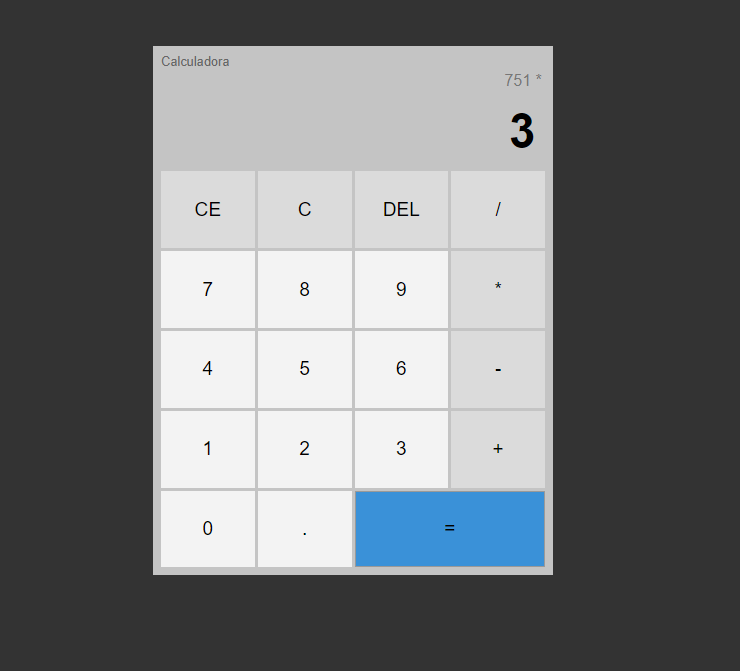

# Calculator JS (Calculadora - JavaScript)

Projeto de uma calculadora comum feita com interface em browser.

## :mag_right:Sobre o projeto
Projeto realizado conforme vídeo do canal Hora de Codar, feito com a intenção de relembrar manipulação de DOM e lógica no geral. Devido a simplicidade do projeto não foi necessário utilizar nenhum tipo de framework ou ferramenta além das básicas da web.

## :art: Layout

## :gear: Tecnologias/Ferramentas usadas
- [HTML5](https://developer.mozilla.org/pt-BR/docs/Web/HTML)
- [Javascript](https://developer.mozilla.org/pt-BR/docs/Web/JavaScript)
- [CSS](https://developer.mozilla.org/pt-BR/docs/Web/CSS)

## :file_folder: Como executar o projeto
Realizar o download ou clone do projeto e abrir o arquivo index.html em uma navegador de sua preferencia.
Requisitos: 
- git instalado na máquina

## :raising_hand_man: Autor
Dione Willy Evangelista
https://www.linkedin.com/in/dione-willy-evangelista-59ab8314a/